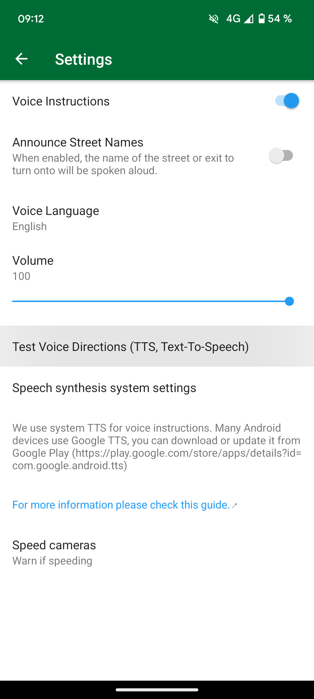

## Общая информация

Organic Maps использует системные службы (движки) и настройки преобразования текста в речь (TTS) для голосовых инструкций. На разных устройствах используются разные движки по умолчанию. Можно выбрать Google Text-to Speech, движок производителя устройства (например, Samsung) или сторонний движок.

Если системные движки вас не устраивают, можете попробовать установить [RHVoice](https://rhvoice.org/), это бесплатный речевой движок с открытым исходным кодом, который можно загрузить из [Google Play](https://play.google.com/store/apps/details?id=com.github.olga_yakovleva.rhvoice.android) и [F-Droid](https://f-droid.org/en/packages/com.github.olga_yakovleva.rhvoice.android/).

## Инструкции

- Откройте приложение "Настройки" на устройстве Android
- Выберите Дополнительные настройки, а затем выберите Доступность
- Выберите предпочтительный движок, скорость речи и высоту тона
- **Перезапустите Organic Maps**
- Зайдите в Настройки => Голосовые инструкции в Organic Maps и настройте, как вам удобно
- Если голос не работает, то снова перезапустите Organic Maps

Если вы не можете найти нужный параметр, откройте приложение "Настройки" и найдите "Текст в речь".

P.S.: Обратите внимание, что эти шаги зависят от марки используемого телефона.

Указанные опции могут не отображаться, если на вашем устройстве еще не установлен TTS. Обратитесь к таблице ниже, чтобы установить любой из них, поддерживающий ваш родной язык.

## Скриншоты

|             |             |
| ----------- | ----------- |
 | 

## Движки синтеза речи

Ниже приведен полный список с указанием нескольких движков и поддерживаемых ими языков (ссылки на скачивание находятся после таблицы):

{{ tts_table() }}

## Проблемы с RHVoice

Если у вас возникли проблемы с инициализацией механизма RHVoice TTS в LineageOS или других кастомных прошивках, попробуйте следующее. RHVoice может инициализироваться неправильно, и приложение может крешнуться, особенно если вы раньше не использовали какой-либо движок TTS на своем телефоне (например, новая установка, сброс настроек к заводским настройкам и т. д.). Если вы используете пользовательскую прошивку, например, LineageOS *без сервисов Google Play и речевых сервисов Google*, и вы хотите использовать RHVoice в качестве предпочтительного движка TTS, следуйте приведенным ниже инструкциям:

1. Установите [eSpeak TTS engine](https://f-droid.org/en/packages/com.reecedunn.espeak), доступный на F-Droid.
2. Установите его в качестве предпочтительного системного движка
    - Перейдите в главный раздел LineageOS **Настройки**.
    - Прокрутите вниз до **Доступность**.
    - Выберите **Вывод текста в речь** и **Предпочитаемый движок** (слева) и убедитесь, что выбран **eSpeak**.
3. Вернитесь назад и нажмите **play**, чтобы проверить, работает ли он.
4. Установите программу [RHVoice](https://f-droid.org/en/packages/com.github.olga_yakovleva.rhvoice.android/), доступную на F-droid.
    - Откройте его, выберите язык, который хотите использовать, нажмите на значок облака (крайний слева), чтобы загрузить голоса.
    - Нажмите кнопку воспроизведения, чтобы проверить, работает ли он.
5. Установите **RHVoice** в качестве предпочтительного движка (см. шаг 2).
6. Теперь вы сможете использовать RHVoice без каких-либо проблем

## Проверка синтеза речи

Чтобы проверить голосовые инструкции, вы можете нажать на "Проверить голосовые подсказки (TTS, Text-To-Speech)" в меню OM "Настройки → Голосовые инструкции" или начать навигацию, чтобы услышать голосовые инструкции. Пока вы стоите на месте, голосовых инструкций не будет.

